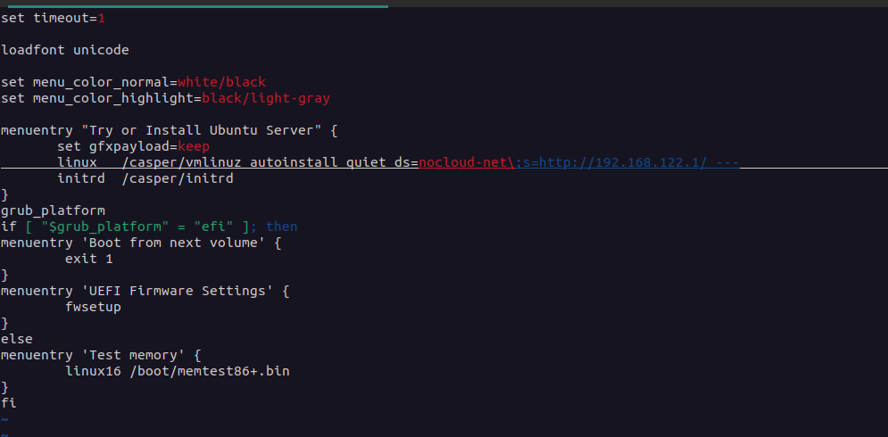
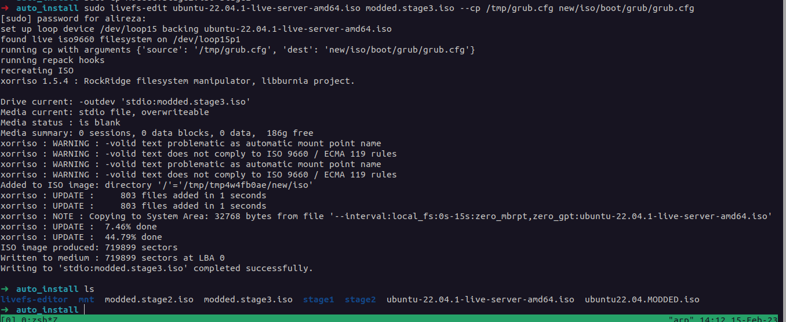
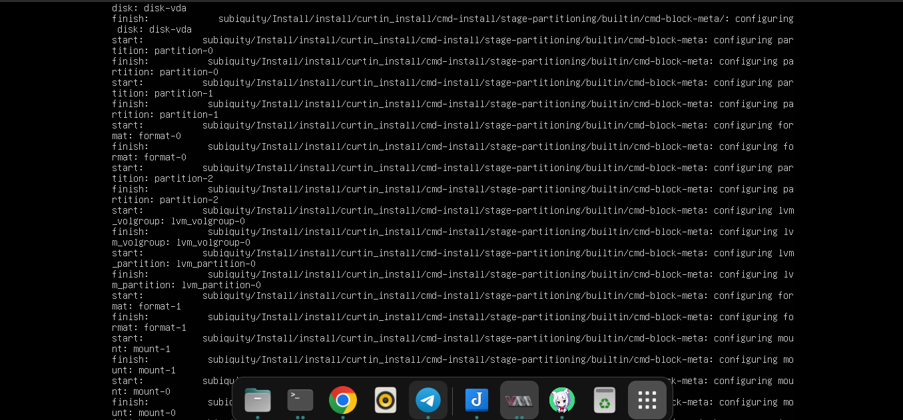

# Prerequisites
```
$ sudo apt install git xorriso squashfs-tools python3-debian gpg liblz4-tool python3-pip -y
```

# steps
* we only need a modified iso and a cloudinit config 

# modifying the iso (grub.cfg)
1. download the ubuntu live server , and save the name of the iso in a variable:
```
ORIG_ISO="ubuntu-22.04.1-live-server-amd64.iso"
```

2. create a `mnt` directory to mount the iso
```
$ mkdir mnt
$ mount -o loop <iso name> mnt
$ cp --no-preserve=all mnt/boot/grub/grub.cfg /tmp/grub.cfg
```

3. adding  `autoinstall quiet ds=nocloud-net\;s=http://192.168.122.1/`  between `/casper/vmlinuz` and `---`
ps: the ip has to be accessible
4. set the timeout to `1` second:

5. for creating a new iso file follow the steps:
* clone the repo:
```
$ git clone https://github.com/mwhudson/livefs-editor
$ cd livefs-editor/
$ python3 -m pip install .
```
* go the the directory of the main iso:
```
$ sudo livefs-edit <$ORIG_ISO> <$MODDED_ISONAME> --cp /tmp/grub.cfg new/iso/boot/grub/grub.cfg
```

* now you have the iso , make  a bootable usb with the iso file
# cloudinit_config
* make another directory and create a file named `user-data` and add the following config:
```
#cloud-config
autoinstall:
  version: 1
  network:
      version: 2
      ethernets:
        eno5:
          dhcp4: false
          addresses:
            - 192.168.0.9/24
          routes:
            - to: default
              via: 192.168.0.1
          nameservers:
            addresses: [8.8.8.8, 1.1.1.1]

  ssh:
    install-server: true
    allow-pw: false

  late-commands:
  	# random hostname 
    - echo ubuntu-host-$(openssl rand -hex 3) > /target/etc/hostname
   # see the ip address 
    - echo "Ubuntu 22.04 LTS \nIP - $(hostname -I)\n" > /target/etc/issue
    # shut-down the host to avoid installation loop
    - shutdown -h now

  user-data:
    #hostname: core1
    disable_root: true
    package_upgrade: false
    users:
      - name: core5g
        primary_group: users
        groups: sudo
        lock_passwd: false
        shell: /bin/bash
        ssh_authorized_keys:
          - "ssh-ed25519 AAAAC3NzaC1lZDI1NTE5AAAAIHm1qQVTEWv9S9ksWqizbgAeYE4/D5OteN3J/HYffpAv alireza@arp" 
        sudo: ALL=(ALL) NOPASSWD:ALL
    chpasswd:
      list: |
        root:1
        core5g:1
      expire: false
    # shutdown after cloud-init config
    power_state:
      mode: reboot
```

user : core5g , root
password : 1 
change the ssh-key with your own public key
***
* make the following empty files or it will fail:
```
$ touch meta-data vendor-data
```

*  serv the current directory with python3 , or nginx :
```
python3 -m http.server 80
```
ps: you have to give the current device ip when modifying the iso file in the first step 

# booting
* just change the boot order to the usb and it should be fine

if you dont see a log like this and get to the normal install , there is somthing wrong with the user-data file
* after installation the server will shutdown , remove the flash drive and power on the server
* wait for all the cloud-init configuration to complete then the server will reboot
* start the server and everything should be fine!
